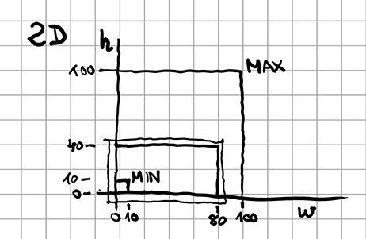
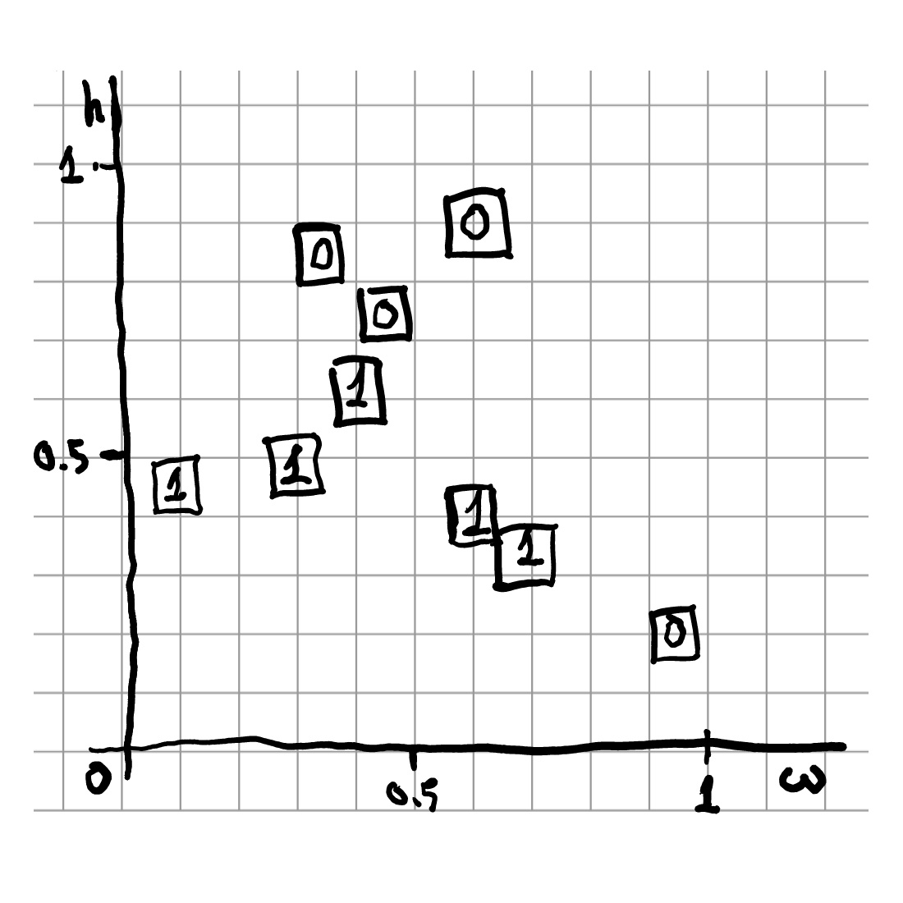
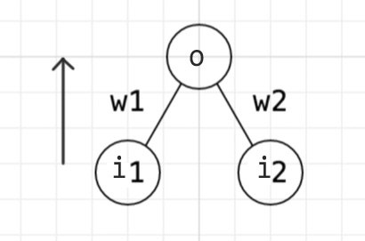
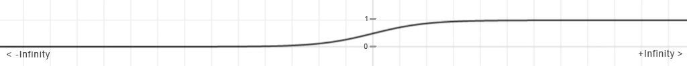
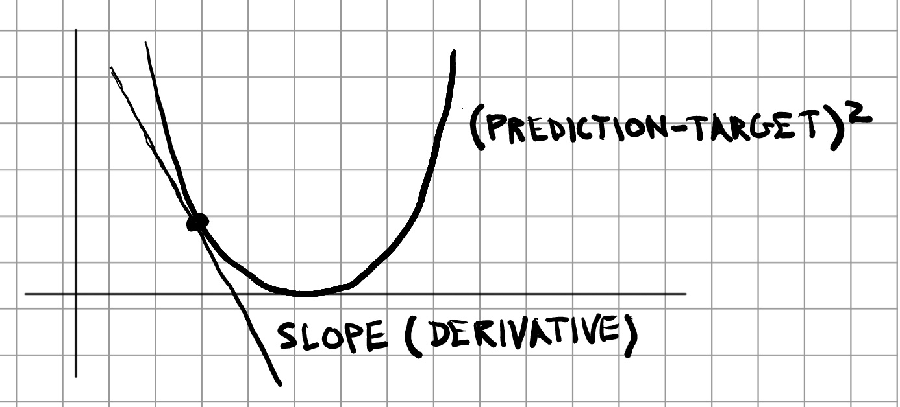
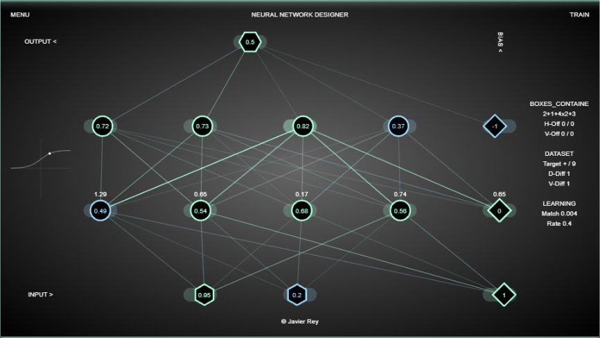

# Neural Network Insights

A quick overview of how a neural network works.

## A simple problem

We have a number of boxes of different sizes and we want to know if they fit in a given container.

We'll simplify the problem to a plane, so figures only have width and height.

Boxes can be as small as 10cm or as big as 100cm side.

The container is 80cm x 40cm, but this is unknown, we'll just check if the boxes we have fit inside the container or not, in one position or another.



Some boxes will be classified as valid (value 1) and others as invalid (value 0).

We can write a table with the measures of the boxes we have and their fitting result.


In metres, so the values are directly suitable for a network input (between 0 and 1), otherwise a mapping function would be required.

We can also draw a diagram of widths and heights with the distribution of the valid and invalid samples.



The goal of our neural network is to predict if new given boxes will be valid or not, so in the distribution diagram they will fall in the area of valid boxes, or in the area of invalid boxes.

In this case, the border that separates both areas seems to be more or less a straight line, so the neural network (a.k.a. perceptron) that makes predictions should not need to be too large.

## The neural network

The neural network (a.k.a. perceptron) is an input-output system that uses nodes (neurons) and bonds (weights) to calculate a result.



The network is run from the input to the output, computing the sum of products of values and weights, plus an optional bias, which acts as a weight adjustment.

The sum is processed by an `activation` function, which transforms any given value into a fraction between 0 and 1.

```javascript
activation(i1 * w1 + i2 * w2 + bias)
```

The most universal activation function for neural networks is called the `sigmoid`, defined as `1 / (1 + Math.exp(-x))`, (`exp` is constant `E` raised to exponent), and it tends to `0` on `-Infinity`, and to `1` on `+Infinity`, transitioning smoothly from one value to the other around `x = 0`.



## Training the neural network

By applying the activation function to our network inputs and neurons, we don't get the intended result directly.

The network needs to be trained, altering the weights with random values multiple times in a process called `back-propagation`.

As the initial prediction is completely random, and likely wrong, the training process requires replacing the random output by the known result inputs.

A function called `cost-function`, defined as `Math.pow(prediction - target, 2)`, computes the difference between the intial value and the expected value, producing a parabola which is used to change the prediction towards the desired result.

The derivative of the cost function is the slope tangent, which is negative on the left-hand side of the parabola and positive on the right-hand side. It marks the trend of the difference, allowing the next calculation to move towards a better result.



In most cases, even simple ones, the neural network will need intermediate layers of neurons, the `hidden layers`, so the network is flexible enough to travel to the desired state, where weights will be increased, making the network more rigid, but closer to the expected output.

If the network is not well designed for the purpose of the use case, it may never converge into a consistent result, or it may even diverge.

Here is an interactive playground to design a neural network and train it: <a href="../../" target="_blank">Neural Network Designer</a>

<a href="../../" target="_blank">
    
</a>

[//]: # ([< Prev]./)

[//]: # ([Next >]./nnd-doc-1.md)
